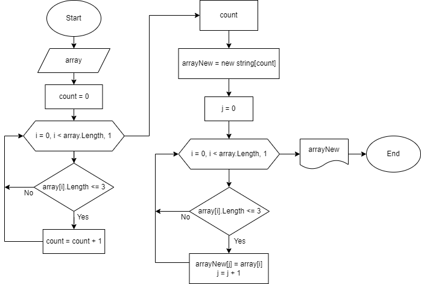

# ***Итоговая проверочная работа***

## **Задача** 

### *Условие задачи*
>Написать программу, которая из имеющегося массива строк
формирует массив из строк, длина которых меньше либо равна 3 символа.
Первоначальный массив можно ввести с клавиатуры, либо задать
на старте выполнения алгоритма. При решении не рекомендуется
пользоваться коллекциями, лучше обойтись исключительно массивами.
>>#### *Примеры*
>>+ ["hello", "2", "world", ":-)"] -> ["2", ":-)"]
>>+ ["1234", "1567", "-2", "computer sciense"] -> ["-2"]
>>+ ["Russia", "Denmark", "Kazan"] -> []

### *Решение*
1. Просим пользователя ввести значения массива через пробел.
2. Считываем значения, которые ввел пользователь, и преобразуем в массив строк.
3. Подсчитываем количество элементов массива, длина которых меньше либо равна 3 символа.
4. Задаем новый массив с количеством элементов из пункта 3.
5. Заполняем новый массив элементами исходного массива, длина которых меньше либо равна 3 символа.
6. Выводим на экран полученный массив

### *Использованные методы*
|Метод *CountArrayElements*|Метод *ThreeCharacterElements*|
|-|-|
|Подсчитывает количество элементов массива, длина которых  меньше либо равна 3 символа.|Задает массив с необходимым количеством элементов и заполняет заданный массив элементами исходного массива, длина которых меньше либо равна 3 символа.|

### *Блок-схема*

